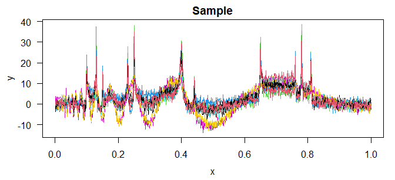

# fda.simu

O pacote `fda.simu` permite a utilização de técnincas da *Análise de
Dados Funcionais Agregados* a partir da expansão das observações por
ondaletas (*wavelets*). No geral, neste tipo de problema, tem-se o
interesse em estimar curvas componentes a partir de uma amostra
agregada, isto é, cada elemento da amostra é uma combinação linear de
$L$ funções componentes. Além disso, este pacote considera a utilização
de erro gaussiano e positivo (Gama), usufruindo da teoria apresentada em
Sousa (2024) e Sousa e Garcia (2023).

## Instalação

A instalação do pacote é feita através de:

``` r
# install.packages("devtools")
devtools::install_github("jsicas/fda.simu")
```

## Exemplo

Considerando as funções Bumps e Doppler (funções de teste de Donoho e
Johnstone), pode-se gerar uma amostra agregada tamanho `I=10` com razão
sinal-ruído `snr=5` contaminada de um erro aditivo gaussiano.


``` r
library(fda.simu)

# gerando amostra
alpha <- matrix(c(f_test()$bumps, f_test()$doppler, f_test()$blocks), ncol=3)
sample <- sample_gen(alpha, snr=5, I=10)
plot(sample)
```



A partir da amostra é aplicada a transformada discreta de ondaletas
(DWT), estimado os coeficientes de ondaleta e feita a transformada
inversa (IDWT) para retornar ao domínio original da função, o que pode
ser feito pela função `desagrega`.

``` r
# recuperando a função original
f_hat <- desagrega(data=sample$fun, y=sample$y)
```

Com isso, tem-se as funções estimadas (em preto), as quais podem ser
comparadas com as verdadeiras (em azul).


## Referências

Sousa, A. R. S. (2024). A Wavelet-Based Method in Aggregated Functional
Data Analysis. *Monte Carlo Methods and Applications* 30.1, pp. 19–30.
DOI: [10.1515/mcma-2023-2016](https://doi.org/10.1515/mcma-2023-2016).

Sousa, A. R. S. e Garcia, N. L. (2023). Wavelet shrinkage in
nonparametric regression models with positive noise. *Journal of
Statistical Computation and Simulation* 93.17, pp. 3011–3033. DOI:
[10.1080/00949655.2023.2215372](https://doi.org/10.1080/00949655.2023.2215372).
